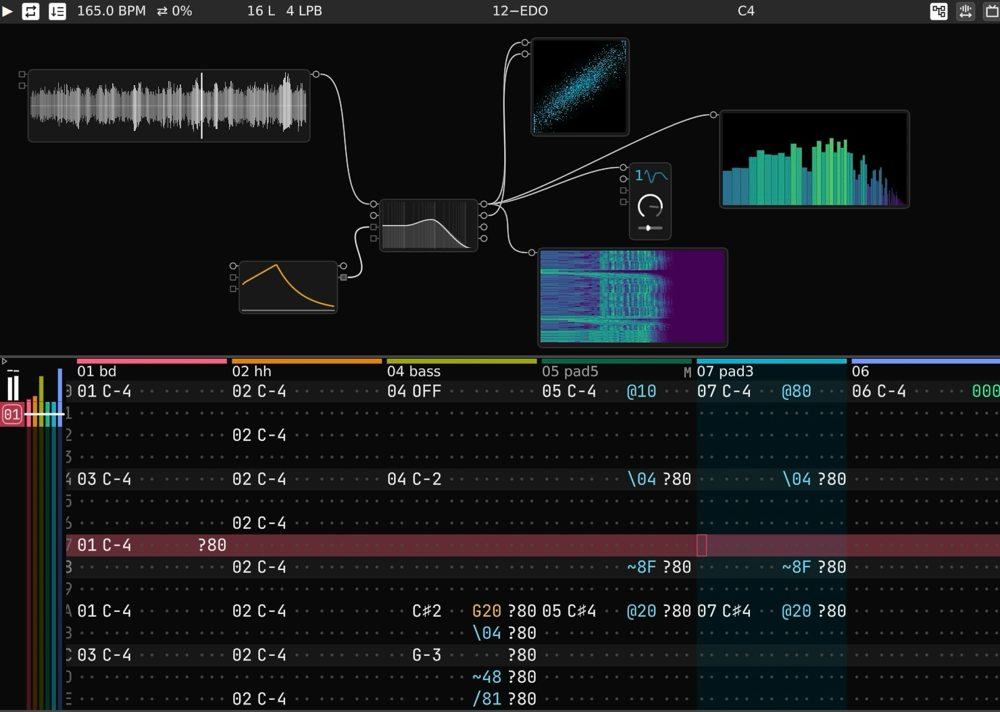

# The Cuis website

The website of Cuis Smalltalk is published at [cuis.st](https://cuis.st) with GitHub Pages.

## Run the site

The `Pages` workflow (`.github/workflows/pages.yml`) builds the site with Jekyll on every push to `master`, with Ruby 4.0.7 and the gems of `Gemfile.lock`, and GitHub Pages publishes it. To run it on your machine with the same versions, use Docker:

```
docker compose up
```

The first time, it takes a few minutes to install everything. When it shows `Server running`, open http://localhost:4000. Leave it running while you follow any of the guides below: each change you save shows up there.

Without Docker, with Ruby 4.0.7 installed:

```
bundle install
bundle exec jekyll serve --livereload
```

## Contributing

### Want to write a documentation page?

Say you wrote a guide on loading fonts in Cuis.

1. **Pick its section.** A page goes in one of these folders of `_docs/`: `tutorials`, `how-to-guides`, `reference` or `explanation`. On the site, each section says under its title what goes in it. A guide on loading fonts goes in `how-to-guides`.

2. **Create `_docs/how-to-guides/loading-fonts.md`.** The address of a page comes from its path: `_docs` becomes `/documentation` and `.md` is dropped. This page is published at `/documentation/how-to-guides/loading-fonts`. Name the file like the other pages, with lowercase words and hyphens.

3. **Start it with its front matter.** It goes between two `---` lines, with the title of the page and a one-sentence description. The description is shown under the title and in the list of its section, so write it to tell the reader what they get from the page:

   ```yaml
   ---
   title: "Loading fonts in Cuis"
   description: "How to install TrueType fonts and use them in the system."
   ---
   ```

4. **Write the page in Markdown**, below the front matter. These are the conventions of the site:

   * A table of contents of the `##` headings is the line ``, right after the front matter. An author line is a line like `By Juan Vuletich · 2026-10`, with `{: .post-meta}` on the line right below it. Both are optional. With both, they go in this order:

     ```markdown
     ---
     title: "Loading fonts in Cuis"
     description: "How to install TrueType fonts and use them in the system."
     ---

     

     By Juan Vuletich · 2026-10
     {: .post-meta}

     ## Installing a font
     ```

   * Code goes in a fenced block with its language, so it gets highlighted:

     ````markdown
     ```smalltalk
     Feature require: 'Sound'.
     Feature require: 'WebClient'.
     ```
     ````

   * Buttons and menu items go in `<kbd>`, so they are shown as buttons:

     ```markdown
     It is at <kbd>World</kbd> / <kbd>Open</kbd> / <kbd>Installed Packages</kbd>.
     ```

   * A link to another page uses its address through `relative_url`, so that it also works when the site is published under a path, as in a fork:

     ```markdown
     Please take a look at [Getting help with Cuis]({{ "/documentation/how-to-guides/getting-help" | relative_url }}).
     ```

   * A tip goes in this block. For a fact, change `lightbulb` to `info`. For a warning, change it to `triangle-alert`, and `class="note"` to `class="note debugger"`:

     ```html
     <div class="note" markdown="1">
     <svg class="icon"><use href="{{ "/assets/icons.svg#lightbulb" | relative_url }}"></use></svg>

     The text of the tip, in Markdown.

     </div>
     ```

5. **Add it to the section list.** The list of a section only shows the pages named in the `entries` of its `index.md`, in that order, so you decide where yours goes. Open `_docs/how-to-guides/index.md` and, under `entries:`, add the line `- doc: loading-fonts` where you want it, indented like the others. It is the file name of your page, without `.md`:

   ```yaml
   ---
   permalink: /documentation/how-to-guides/
   title: How-to guides
   description: "Steps to solve specific problems when working with Cuis."
   entries:
     - doc: managing-your-code
     - doc: loading-fonts
     # the other entries of the list
   ---
   ```

   A page missing from `entries`, or with its name misspelled, is published but not listed.

### Want to link a resource hosted elsewhere?

Add an item to the `entries` of the section's `index.md`, at the position you want in the list. Unlike a `- doc:` line, it has its own `title`, `url` and `description`, and its description can use Markdown:

```yaml
entries:
  - doc: why-smalltalk-80
  - title: "Design Principles Behind Smalltalk"
    url: https://www.cs.virginia.edu/~evans/cs655/readings/smalltalk.html
    description: "The purpose of the Smalltalk project is to provide computer support for the creative spirit in everyone."
```

`url` can also be an address of this site, such as `/overview`.

To show an author line below the description, as for a paper, add `author` and `date`, and `event` if it was presented at one:

```yaml
  - title: "Unicode support in Cuis Smalltalk"
    url: https://github.com/Cuis-Smalltalk/Cuis-Smalltalk-Dev/blob/master/Documentation/Papers/2022-11-UnicodeSupportInCuisSmalltalk.pdf
    description: "It describes the approach used to support Unicode in Smalltalk source code and generally in Text objects."
    author: "Juan Vuletich"
    date: "2022-11"
    event: "FAST Workshop 2022"
```

The tutorials page has a second list, "Other resources". Its items go under `other_resources` instead of `entries`.

### Want to group pages in a subsection?

Say `reference` has several pages about the VM, and you want them together in a subsection called `vm`.

1. **Create the folder `_docs/reference/vm/`** and move those pages into it.

2. **Create `_docs/reference/vm/index.md`.** It is the page of the subsection, with its own list:

   ```yaml
   ---
   permalink: /documentation/reference/vm/
   title: "The VM"
   description: "The virtual machine Cuis runs on."
   entries:
     - doc: building-the-vm
     - doc: vm-plugins
   ---

   
   ```

   Its `entries` name the pages of its folder. An `index.md` doesn't get the address of its folder on its own: the `permalink` gives it, ending in `/`. Without it, the line `- doc: vm/` of the section matches nothing and the subsection is left out of its list, and the breadcrumb of its pages skips it. The last line shows the list.

3. **Update the list of the section.** In `_docs/reference/index.md`, remove the lines of the pages you moved, and add one line for the subsection where you want it, with a slash at the end: `- doc: vm/`.

A subsection can have its own subsections, built the same way.

### Want to add a talk?

Add an entry anywhere in `_data/talks.yml`: the page sorts them by date.

```yaml
- title: "A Tour to the Morphic UI in Cuis"
  description: "Morphic is a User Interface framework that encourages the construction of domain specific visual metaphors and interactive graphical objects."
  speaker: "Juan Vuletich"
  event: "Smalltalks 2025"
  date: "2025-11"
  video: https://youtu.be/TWtYkqhfqNQ
  code: https://github.com/Cuis-Smalltalk/Cuis-Smalltalk-Dev/blob/master/Documentation/Presentations/2025-11-TourToMorphicUIinCuis/Smalltalks2025.pck.st
```

* `video` is required. For a YouTube video, use the link of its Share button, which starts with `https://youtu.be/`: the page shows its thumbnail and plays it in place. Any other link, like the one of a podcast, shows its domain, such as `shows.acast.com`.
* `date` is `"YYYY-MM"` or `"YYYY-MM-DD"`, in quotes.
* `event`, `slides` and `code` are optional. `slides` and `code` are links to the slides and the code of the talk, shown below it.
* `description` is plain text: Markdown in it is not converted.

### Want to add a news post?

Create a file in `_posts/` whose name starts with the date of the post, such as `_posts/2026-10-06-october-meeting.md`, and start it with:

```yaml
---
title: "October Cuis Meeting"
date: 2026-10-06
layout: post
---
```

The date is the day you publish it, not the day of what it announces: a post with a future date is not published. Use the same date in the name and in `date`. This post is published at `/2026/10/06/october-meeting.html`. `layout: post` gives it the design of a news post. Its first paragraph is the summary shown in the news list and on the home page.

To give a date and time, such as the one of a meeting, write `` with the time in GMT: each visitor sees it in their own time zone.

### Want to add a meeting recording?

Add an entry anywhere in `_data/past-meetings.yml`: the Community page sorts them by date.

```yaml
- title: "LiveTyping"
  description: "Automatic Type Annotation for Dynamically Typed Languages. Introduction to the concept. Possibilities. Demo."
  chair: "Hernán Wilkinson"
  date: "2022-04"
  video: https://youtu.be/5ITBQ8a5vlQ
```

It works like a talk, with `chair` instead of `speaker`: the person who presented or led the meeting.

### Want to add a story?

1. **Put its image in `assets/imgs/stories/`.** Use a landscape JPG at least 1200 pixels wide.

2. **Copy this block:**

   ```html
   <article class="story">
     <div>
       <p class="post-meta">7 September 2026</p>
       <h2>Signals</h2>
       <p>Signals is a lively environment for real-time musical synthesis.</p>
       <p><a href="https://github.com/len/Signals">read more</a></p>
     </div>
     
   </article>
   ```

3. **Paste it in `_pages/stories.md`**, inside `<div class="stories">` and before the first `<article>`, so it is shown first.

4. **Fill it in** with today's date written like `7 September 2026`, the title, the text and the link of "read more". In `src`, replace `signals.jpg` with the file name of your image. The text is HTML, so each paragraph goes in its own `<p>`.

### Want to add a nice comment?

Add an entry at the end of `_data/quotes.yml`, which goes from the oldest comment to the newest. The Nice comments page shows them in the order of the file.

```yaml
- text: "I like it... It's nice and clean and simple and pretty. Nice stuff!"
  author: "Alan Kay"
  author_url: https://en.wikipedia.org/wiki/Alan_Kay
  photo: alan-kay.jpg
  date: 2007-04-27
  source: https://lists.squeakfoundation.org/pipermail/squeak-dev/2007-April/115962.html
```

* Write the comment in `text` without quotation marks of its own: the page adds them.
* `photo` is the file name of a black and white square photo in `assets/imgs/faces/`. Without it, a generic avatar is shown.
* `source` links to where it was said. If it was said in private, use `private: true` instead.
* `author_url` is optional, and links the name of the author.
* `featured: 4` also shows the comment on the home page, after the ones with `featured` 1, 2 and 3. For the home page, you can write a shorter version of the comment in `excerpt`.

### Want to add a screenshot to the home page?

Put the image in `assets/imgs/home/`, and add an entry to `screenshots` in the front matter of `_pages/frontpage.md`. The slideshow shows them in that order.

```yaml
screenshots:
  - image: ide.png
    alt: "The Cuis Smalltalk development environment"
    caption: "A typical work-in-progress scene in Cuis Smalltalk application development: …"
```

`caption` is plain text: Markdown in it is not converted.

## References

- [GitHub Pages](https://docs.github.com/en/pages)
- [Jekyll](https://jekyllrb.com)
